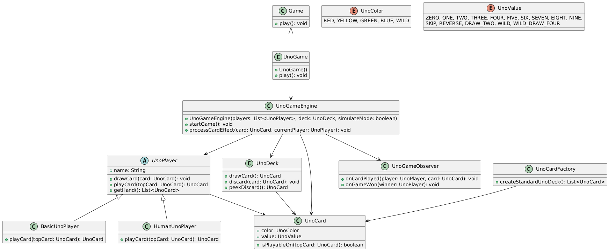

# Uno Game Engine - Author Documentation

## Introduction

Uno is a classic card game, first developed by Merle Robbins in 1971, in which players compete to empty their hand by matching the top discard card in color or value. Over the years, it has become popular worldwide, spawning variations with unique house rules and new card types.

The **Uno Game Engine** is a Java-based framework that allows developers to create and extend Uno game variations while maintaining flexibility and modularity. The engine is built using Object-Oriented Programming (OOP) principles and incorporates several design patterns, including **Factory Pattern**, **Observer Pattern**, and **Strategy Pattern**, ensuring that the game logic is adaptable and maintainable. This documentation outlines the system's architecture, design decisions, implementation details, and guidelines for extending the engine to support new variations and rules.

## Requirements

### Functional Requirements

- The game must support **both human and AI players**.
- Players must follow Uno rules, including **special action cards** (Skip, Reverse, Draw Two, Wild, Wild Draw Four).
- The engine should allow **customization of rules and gameplay mechanics**.
- The game should be playable in **interactive and simulation modes**.

### Non-functional Requirements

- The system must adhere to **SOLID principles**.
- The game logic must be **extensible without modifying core classes**.
- It should provide **console-based colored output** for improved readability.
- The system should include **proper error handling and input validation**.

## Design

#### Object-Oriented Design in the Code

The Uno Game Engine follows an **object-oriented design (OOD)** that promotes encapsulation, modularity, and reusability. Here’s how OOD principles are applied:

1. **Encapsulation**: Each class has clearly defined responsibilities. For example, `UnoCard` encapsulates card properties (color, value), while `UnoDeck` encapsulates the draw and discard piles.
2. **Abstraction**: The `UnoPlayer` interface abstracts the behavior of both human and AI players.
3. **Inheritance**: `BasicUnoPlayer` and `HumanUnoPlayer` both inherit from `UnoPlayer`, enabling polymorphism.
4. **Polymorphism**: Different player types (`BasicUnoPlayer`, `HumanUnoPlayer`) override the `playCard()` method, allowing flexibility in player strategies.
5. **Composition**: `UnoGameEngine` uses composition to manage `UnoDeck`, `UnoPlayer`, and `

### Architectural Overview

The Uno Game Engine follows a **modular architecture**, with clearly defined responsibilities for each component. The key design principles include:

- **Separation of Concerns**: The core game logic is decoupled from user interaction and AI strategies.
- **Factory Pattern**: Used for deck generation (`UnoCardFactory`).
- **Observer Pattern**: Enables event-driven updates (`UnoGameObserver`).
- **Strategy Pattern**: Allows different player types (`UnoPlayer`, `BasicUnoPlayer`, `HumanUnoPlayer`).

### Class Diagram


## Sequence Diagram


## Implementation

### Key Components

- **Game (Abstract Class)**: Defines the `play()` method, which must be implemented by any Uno variation.
- **UnoGameEngine**: Manages turns, validates moves, and applies special card effects.
- **UnoDeck**: Handles draw and discard piles.
- **UnoCard & UnoCardFactory**: Represents Uno cards and generates standard decks.
- **UnoPlayer (Interface)**: Abstract representation of a player, implemented by **HumanUnoPlayer** and **BasicUnoPlayer**.
- **ConsoleColors**: Provides ANSI escape sequences for colorized console output.

### Exception Handling
The system includes **try-catch blocks** around critical game loop operations to ensure stability. If an unexpected error occurs, the game skips the affected player's turn and logs the error.


### Defending Against Clean Code Principles (Uncle Bob)

1️⃣ Meaningful Names
> Variable and method names in the code are clear and intention-revealing.
  Example: playCard() instead of doMove().

2️⃣ Small and Focused Functions

>   Functions follow the Single Responsibility Principle.
    Example: UnoDeck.drawCard() only handles drawing, separate from discard logic.

3️⃣ Avoiding Code Smells
> No duplicate code (Don't Repeat Yourself - DRY principle).

4️⃣ Commenting Strategy

> Uses self-explanatory code instead of unnecessary comments.
    Only essential comments (e.g., TODO, explanations of complex logic) are included.

## Defending Against Effective Java (Joshua Bloch)

1️⃣ Factory Methods Over Constructors
> UnoCardFactory follows Item 1: Consider static factory methods instead of constructors.

2️⃣ Avoiding Unnecessary Object Creation
> Uses efficient data structures (List<UnoCard> instead of multiple primitive arrays).

3️⃣ Exception Handling Best Practices
> Uses try-catch blocks around critical sections (Item 69: Use exceptions only for exceptional conditions).

4️⃣ Favoring Composition Over Inheritance
> UnoGameEngine composes UnoDeck and UnoPlayer instead of extending them.

### Defending Against SOLID Principles

1️⃣ Single Responsibility Principle (SRP)
✅ Each class has one clear purpose (UnoDeck handles deck management, UnoGameEngine handles game flow).

2️⃣ Open/Closed Principle (OCP)
✅ New rules can be added without modifying existing classes (UnoGameEngine can be extended for new mechanics).

3️⃣ Liskov Substitution Principle (LSP)
✅ UnoPlayer interface ensures all player types can be used interchangeably.

4️⃣ Interface Segregation Principle (ISP)
✅ The code avoids large interfaces. The UnoPlayer interface has only essential methods.

5️⃣ Dependency Inversion Principle (DIP)
✅ UnoGameEngine depends on abstractions (UnoPlayer) instead of concrete classes (BasicUnoPlayer, HumanUnoPlayer).


### Detailed Class Explanations
Below is an overview of each class with code and an explanation of its role and functionality within the engine.&#x20;

---

#### 1. `Game.java`

```java
public abstract class Game {
    // Abstract method that must be implemented by any concrete game.
    public abstract void play();
}
```

**Explanation**:

- The `Game` class is an abstract base for all game variations.
- It forces subclasses to implement a `play()` method, ensuring a uniform interface.
- In our standard Uno, we have a concrete class `UnoGame` that extends `Game`.

---

#### 2. `UnoGame.java`

```java
import java.util.ArrayList;
import java.util.List;
import java.util.Scanner;

public class UnoGame extends Game {
    private final UnoGameEngine engine;

    public UnoGame() {
        Scanner scanner = new Scanner(System.in);

        System.out.println("Do you want to simulate the game (auto-play)? (Y/N):");
        String simulationChoice = scanner.nextLine().trim().toUpperCase();
        boolean simulate = simulationChoice.equals("Y") || simulationChoice.equals("YES");

        int numPlayers = 0;
        List<UnoPlayer> players = new ArrayList<>();
        System.out.println("Enter number of players (2-10):");
        while (true) {
            try {
                numPlayers = Integer.parseInt(scanner.nextLine());
                if (numPlayers < 2 || numPlayers > 10) {
                    System.out.println("Please enter a number between 2 and 10.");
                    continue;
                }
                break;
            } catch (NumberFormatException e) {
                System.out.println("Invalid number. Please try again.");
            }
        }

        if (simulate) {
            // In simulation mode, create AI players only.
            for (int i = 0; i < numPlayers; i++) {
                players.add(new BasicUnoPlayer("AI_Player_" + (i + 1)));
            }
        } else {
            // In interactive mode, allow mix of human and AI players.
            for (int i = 0; i < numPlayers; i++) {
                System.out.println("Enter name for player " + (i + 1) + ":");
                String name = scanner.nextLine();
                System.out.println("Is " + name + " a human player? (Y/N):");
                String type = scanner.nextLine().trim().toUpperCase();
                if (type.equals("Y") || type.equals("YES")) {
                    players.add(new HumanUnoPlayer(name));
                } else {
                    players.add(new BasicUnoPlayer(name));
                }
            }
        }

        // Create the deck using the factory.
        UnoDeck deck = new UnoDeck(UnoCardFactory.createStandardUnoDeck());
        // Pass the simulation flag to the engine.
        engine = new UnoGameEngine(players, deck, simulate);

        // Add an observer to log game events with colored output.
        engine.addObserver(new UnoGameObserver() {
            @Override
            public void onCardPlayed(UnoPlayer player, UnoCard card) {
                System.out.println(player.getName() + " played " + card.toColoredString());
            }
            @Override
            public void onGameWon(UnoPlayer winner) {
                System.out.println("Game won by " + winner.getName());
            }
        });
    }

    @Override
    public void play() {
        engine.startGame();
    }
}
```

**Explanation**:

- Extends `Game` and implements `play()`.
- Prompts user for the number of players and whether to run in simulation mode.
- Creates either AI or human players.
- Initializes the `UnoDeck` (via `UnoCardFactory`) and instantiates `UnoGameEngine`.
- Implements an observer to track when a card is played or a player wins.

---

#### 3. `UnoGameEngine.java`

```java
import java.util.ArrayList;
import java.util.List;
import java.util.Random;
import java.util.Scanner;

public class UnoGameEngine {
    private final List<UnoPlayer> players;
    private final UnoDeck deck;
    private final List<UnoGameObserver> observers;
    private int currentPlayerIndex;
    private int direction; // 1 for clockwise, -1 for counter-clockwise
    private final boolean simulateMode; // new flag to determine simulation mode
    private static final Scanner scanner = new Scanner(System.in);

    public UnoGameEngine(List<UnoPlayer> players, UnoDeck deck, boolean simulateMode) {
         if (players.size() < 2) {
             throw new IllegalArgumentException("At least two players required.");
         }
         this.players = players;
         this.deck = deck;
         this.observers = new ArrayList<>();
         this.currentPlayerIndex = 0;
         this.direction = 1;
         this.simulateMode = simulateMode;
         // Deal initial hand (7 cards per player)
         for (int i = 0; i < 7; i++) {
             for (UnoPlayer player : players) {
                 player.drawCard(deck.drawCard());
             }
         }
         // Start the discard pile with one card.
         UnoCard firstCard = deck.drawCard();
         // If the first card is wild, set a default color.
         if (firstCard.getColor() == UnoColor.WILD) {
             firstCard = new UnoCard(UnoColor.RED, firstCard.getValue());
         }
         deck.discard(firstCard);
    }

    public void addObserver(UnoGameObserver observer) {
         observers.add(observer);
    }

    public void startGame() {
         boolean gameWon = false;
         while (!gameWon) {
             try {
                 UnoPlayer currentPlayer = players.get(currentPlayerIndex);
                 UnoCard topCard = deck.peekDiscard();
                 System.out.println("\nCurrent player: " + currentPlayer.getName());
                 System.out.println("Top card: " + topCard.toColoredString());

                 // If in simulation mode, print the current player's hand horizontally.
                 if (simulateMode) {
                     System.out.print("Player's hand: ");
                     for (int i = 0; i < currentPlayer.getHand().size(); i++) {
                         System.out.print("[" + i + "]: " + currentPlayer.getHand().get(i).toColoredString() + "  ");
                     }
                     System.out.println();
                 }

                 UnoCard playedCard = currentPlayer.playCard(topCard);
                 if (playedCard != null) {
                     deck.discard(playedCard);
                     notifyCardPlayed(currentPlayer, playedCard);
                     // Process special effects; note we pass the current player.
                     processCardEffect(playedCard, currentPlayer);
                     if (currentPlayer.getHand().isEmpty()) {
                         notifyGameWon(currentPlayer);
                         System.out.println(currentPlayer.getName() + " wins the game!");
                         gameWon = true;
                         break;
                     }
                 } else {
                     UnoCard drawn = deck.drawCard();
                     currentPlayer.drawCard(drawn);
                     System.out.println(currentPlayer.getName() + " drew a card: " + drawn.toColoredString());
                     // Print the updated hand horizontally.
                     System.out.print("Updated Hand: ");
                     for (UnoCard card : currentPlayer.getHand()) {
                         System.out.print(card.toColoredString() + "  ");
                     }
                     System.out.println();
                 }
                 moveToNextPlayer();
             } catch (Exception e) {
                 System.out.println("An unexpected error occurred: " + e.getMessage());
                 e.printStackTrace();
                 moveToNextPlayer(); // Skip turn on error.
             }
         }
    }

    private void processCardEffect(UnoCard card, UnoPlayer currentPlayer) {
         switch(card.getValue()) {
             case REVERSE:
                 direction *= -1;
                 break;
             case SKIP:
                 moveToNextPlayer();
                 break;
             case DRAW_TWO:
                 UnoPlayer nextPlayer = getNextPlayer();
                 nextPlayer.drawCard(deck.drawCard());
                 nextPlayer.drawCard(deck.drawCard());
                 moveToNextPlayer();
                 break;
             case WILD:
                 UnoColor chosenColor = chooseColor(currentPlayer);
                 UnoCard newWild = new UnoCard(chosenColor, UnoValue.WILD);
                 deck.replaceTopCard(newWild);
                 System.out.println("Wild played. Color changed to " + chosenColor);
                 break;
             case WILD_DRAW_FOUR:
                 UnoColor chosenColorDrawFour = chooseColor(currentPlayer);
                 UnoCard newWildDrawFour = new UnoCard(chosenColorDrawFour, UnoValue.WILD_DRAW_FOUR);
                 deck.replaceTopCard(newWildDrawFour);
                 System.out.println("Wild Draw Four played. Color changed to " + chosenColorDrawFour);
                 UnoPlayer nextPlayer4 = getNextPlayer();
                 for (int i = 0; i < 4; i++) {
                     nextPlayer4.drawCard(deck.drawCard());
                 }
                 moveToNextPlayer();
                 break;
             default:
                 break;
         }
    }

    private UnoColor chooseColor(UnoPlayer player) {
         if (player instanceof HumanUnoPlayer) {
             System.out.println(player.getName() + ", choose a color (RED, YELLOW, GREEN, BLUE):");
             while (true) {
                  String input = scanner.nextLine().trim().toUpperCase();
                  try {
                       return UnoColor.valueOf(input);
                  } catch (IllegalArgumentException e) {
                       System.out.println("Invalid color. Please enter one of: RED, YELLOW, GREEN, BLUE");
                  }
             }
         } else {
             UnoColor[] colors = {UnoColor.RED, UnoColor.YELLOW, UnoColor.GREEN, UnoColor.BLUE};
             UnoColor chosen = colors[new Random().nextInt(colors.length)];
             System.out.println(player.getName() + " chooses color " + chosen);
             return chosen;
         }
    }

    private void moveToNextPlayer() {
         currentPlayerIndex = (currentPlayerIndex + direction + players.size()) % players.size();
    }

    private UnoPlayer getNextPlayer() {
         int nextIndex = (currentPlayerIndex + direction + players.size()) % players.size();
         return players.get(nextIndex);
    }

    private void notifyCardPlayed(UnoPlayer player, UnoCard card) {
         for (UnoGameObserver observer : observers) {
             observer.onCardPlayed(player, card);
         }
    }

    private void notifyGameWon(UnoPlayer winner) {
         for (UnoGameObserver observer : observers) {
             observer.onGameWon(winner);
         }
    }
}
```

**Explanation**:

- **Handles the entire game flow**: turn order, card drawing, card discarding, and checking for winners.
- Uses a **simulation mode flag** to determine whether to prompt for real user input or run automatically (AI only). In simulation mode, the engine prints each player’s hand for debugging.
- **processCardEffect** method handles special cards (Skip, Reverse, Draw Two, Wild, Wild Draw Four).
- **Exception Handling** ensures the game continues even if an unexpected error occurs.

---

#### 4. `UnoDeck.java`

```java
import java.util.Collections;
import java.util.List;
import java.util.Stack;

public class UnoDeck {
    private final Stack<UnoCard> drawPile;
    private final Stack<UnoCard> discardPile;

    public UnoDeck(List<UnoCard> cards) {
         this.drawPile = new Stack<>();
         this.drawPile.addAll(cards);
         Collections.shuffle(drawPile);
         this.discardPile = new Stack<>();
    }

    public UnoCard drawCard() {
         if (drawPile.isEmpty()) {
             UnoCard topDiscard = discardPile.pop();
             drawPile.addAll(discardPile);
             discardPile.clear();
             discardPile.push(topDiscard);
             Collections.shuffle(drawPile);
         }
         return drawPile.pop();
    }

    public void discard(UnoCard card) {
         discardPile.push(card);
    }

    public UnoCard peekDiscard() {
         return discardPile.peek();
    }

    public void replaceTopCard(UnoCard newCard) {
         if (!discardPile.isEmpty()) {
             discardPile.pop();
         }
         discardPile.push(newCard);
    }
}
```

**Explanation**:

- Maintains a **draw pile** (facedown stack) and **discard pile**.
- **drawCard** automatically refills from the discard pile if the draw pile is empty.
- **replaceTopCard** is used for changing the top card’s color when a Wild is played.

---

#### 5. `UnoCard.java`

```java
public class UnoCard {
    private final UnoColor color;
    private final UnoValue value;

    public UnoCard(UnoColor color, UnoValue value) {
        this.color = color;
        this.value = value;
    }

    public UnoColor getColor() {
        return color;
    }

    public UnoValue getValue() {
        return value;
    }

    public boolean isPlayableOn(UnoCard topCard) {
        return this.color == UnoColor.WILD ||
               this.color == topCard.getColor() ||
               this.value == topCard.getValue();
    }

    public String toColoredString() {
         String colorCode = "";
         switch(color) {
             case RED: colorCode = ConsoleColors.RED; break;
             case GREEN: colorCode = ConsoleColors.GREEN; break;
             case YELLOW: colorCode = ConsoleColors.YELLOW; break;
             case BLUE: colorCode = ConsoleColors.BLUE; break;
             default: colorCode = ""; break;
         }
         return colorCode + (color == UnoColor.WILD ? "" : color.toString() + " ") 
                + value.toString() + ConsoleColors.RESET;
    }

    @Override
    public String toString() {
         return (color == UnoColor.WILD ? "" : color.toString() + " ") + value.toString();
    }
}
```

**Explanation**:

- Each `UnoCard` has a **color** and a **value**.
- `isPlayableOn` checks if the card can be placed on the discard pile based on the color or value.
- `toColoredString()` uses **ANSI codes** to display colorized text in the console.

---

#### 6. `UnoColor.java`

```java
public enum UnoColor {
    RED, YELLOW, GREEN, BLUE, WILD
}
```

**Explanation**:

- An enum listing all possible Uno colors, including **WILD**.

---

#### 7. `UnoValue.java`

```java
public enum UnoValue {
    ZERO, ONE, TWO, THREE, FOUR, FIVE, SIX, SEVEN, EIGHT, NINE,
    SKIP, REVERSE, DRAW_TWO, WILD, WILD_DRAW_FOUR;
}
```

**Explanation**:

- Lists all valid card values: number cards and action cards.

---

#### 8. `UnoCardFactory.java`

```java
import java.util.ArrayList;
import java.util.List;

public class UnoCardFactory {
    public static List<UnoCard> createStandardUnoDeck() {
        List<UnoCard> deck = new ArrayList<>();
        for (UnoColor color : UnoColor.values()) {
            if (color == UnoColor.WILD) continue;
            deck.add(new UnoCard(color, UnoValue.ZERO));
            for (int i = 0; i < 2; i++) {
                for (UnoValue value : UnoValue.values()) {
                    if (value == UnoValue.ZERO || value == UnoValue.WILD || value == UnoValue.WILD_DRAW_FOUR)
                        continue;
                    deck.add(new UnoCard(color, value));
                }
            }
        }
        for (int i = 0; i < 4; i++) {
            deck.add(new UnoCard(UnoColor.WILD, UnoValue.WILD));
            deck.add(new UnoCard(UnoColor.WILD, UnoValue.WILD_DRAW_FOUR));
        }
        return deck;
    }
}
```

**Explanation**:

- Implements the **Factory Pattern**, generating the standard 108-card Uno deck.
- Wild and Wild Draw Four cards are added separately.

---

#### 9. `ConsoleColors.java`

```java
public class ConsoleColors {
    public static final String RESET = "\u001B[0m";
    public static final String RED = "\u001B[31m";
    public static final String GREEN = "\u001B[32m";
    public static final String YELLOW = "\u001B[33m";
    public static final String BLUE = "\u001B[34m";
}
```

**Explanation**:

- Defines **ANSI escape sequences** for coloring console output.
- Used in `UnoCard#toColoredString()`.

---

#### 10. `UnoPlayer.java`

```java
import java.util.List;

public interface UnoPlayer {
    void drawCard(UnoCard card);
    UnoCard playCard(UnoCard topCard);
    List<UnoCard> getHand();
    String getName();
}
```

**Explanation**:

- An interface that all player types must implement.
- `playCard` is how players decide which card to play.
- `drawCard` is called when the player must draw from the deck.

---

#### 11. `BasicUnoPlayer.java`

```java
import java.util.ArrayList;
import java.util.List;
import java.util.Random;

public class BasicUnoPlayer implements UnoPlayer {
    private final String name;
    private final List<UnoCard> hand;
    protected final Random random;

    public BasicUnoPlayer(String name) {
        this.name = name;
        this.hand = new ArrayList<>();
        this.random = new Random();
    }

    @Override
    public void drawCard(UnoCard card) {
        hand.add(card);
    }

    @Override
    public UnoCard playCard(UnoCard topCard) {
        // Without using streams:
        List<UnoCard> playable = new ArrayList<>();
        for (UnoCard card : hand) {
            if (card.isPlayableOn(topCard)) {
                playable.add(card);
            }
        }
        if (playable.isEmpty()) {
            return null;
        }
        UnoCard chosen = playable.get(random.nextInt(playable.size()));
        hand.remove(chosen);
        return chosen;
    }

    @Override
    public List<UnoCard> getHand() {
        return hand;
    }

    @Override
    public String getName() {
        return name;
    }
}
```

**Explanation**:

- A **simple AI** player that picks a random playable card.
- If no cards are playable, returns `null` to signal the engine that it must draw.
- Uses a `Random` instance for card selection.

---

#### 12. `HumanUnoPlayer.java`

```java
import java.util.ArrayList;
import java.util.List;
import java.util.Scanner;

public class HumanUnoPlayer implements UnoPlayer {
    private final String name;
    private final List<UnoCard> hand;
    private static final Scanner scanner = new Scanner(System.in);

    public HumanUnoPlayer(String name) {
         this.name = name;
         this.hand = new ArrayList<>();
    }

    @Override
    public void drawCard(UnoCard card) {
         hand.add(card);
    }

    @Override
    public UnoCard playCard(UnoCard topCard) {
         System.out.println("\n" + name + ", it's your turn.");
         System.out.println("Top card on discard pile: " + topCard.toColoredString());
         System.out.print("Your hand: ");
         for (int i = 0; i < hand.size(); i++) {
             System.out.print("[" + i + "]: " + hand.get(i).toColoredString() + "  ");
         }
         System.out.println();
         System.out.println("Enter the number corresponding to the card you want to play (or -1 to draw a card):");
         while(true) {
              try {
                   int choice = Integer.parseInt(scanner.nextLine());
                   if(choice == -1) {
                       return null; // Player opts to draw a card
                   }
                   if(choice < 0 || choice >= hand.size()) {
                       System.out.println("Invalid choice. Please enter a valid number.");
                       continue;
                   }
                   UnoCard selectedCard = hand.get(choice);
                   if(!selectedCard.isPlayableOn(topCard)) {
                       System.out.println("Selected card cannot be played on top of " + topCard.toColoredString());
                       continue;
                   }
                   hand.remove(choice);
                   return selectedCard;
              } catch (NumberFormatException e) {
                   System.out.println("Please enter a valid integer.");
              }
         }
    }

    @Override
    public List<UnoCard> getHand() {
         return hand;
    }

    @Override
    public String getName() {
         return name;
    }
}
```

**Explanation**:

- Prompts a **human player** to select a card index from their hand or draw a card.
- Validates the selected card is playable.
- If the user enters `-1`, signals the engine to draw.

---

#### 13. `UnoGameObserver.java`

```java
public interface UnoGameObserver {
    void onCardPlayed(UnoPlayer player, UnoCard card);
    void onGameWon(UnoPlayer winner);
}
```

**Explanation**:

- Implements the **Observer Pattern**.
- Allows external classes to be notified when a card is played or when a player wins.

---

### Extending the Engine

#### Adding New Rules

1. Extend the `UnoGameEngine` class and override `processCardEffect()`.
2. Modify `UnoCardFactory` to introduce new card types.
3. Implement `UnoGameObserver` for custom event handling.

#### Creating a New Player Type

1. Implement `UnoPlayer` interface.
2. Define logic for `playCard()` and `drawCard()`.
3. Register the new player type in `UnoGame.java`.
